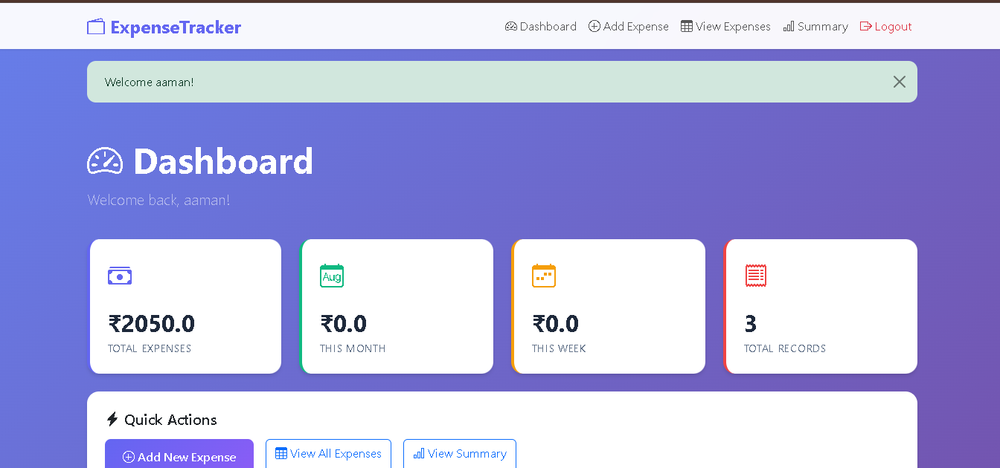
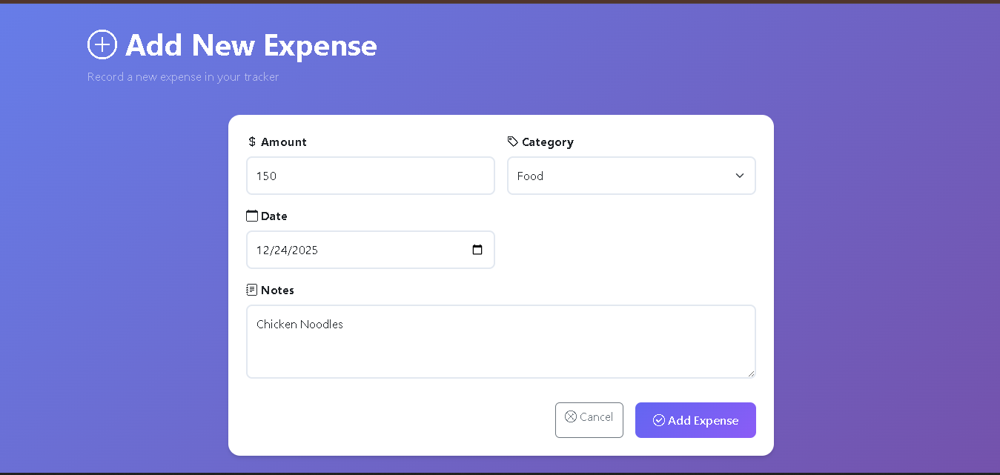
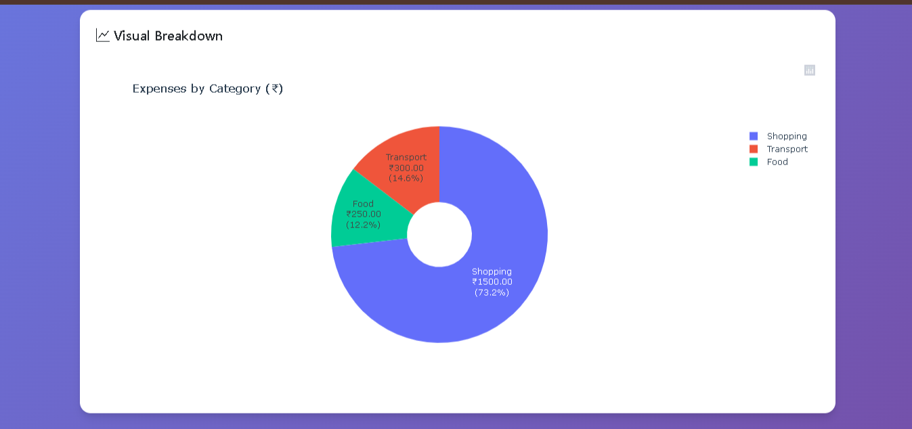

💰 Expense Tracker – Python + MongoDB

A lightweight command-line expense tracker built with Python and MongoDB (PyMongo).
This project helps users to add, view, export, and analyze their expenses using pandas for data manipulation and summary reports.

✨ Features

Add Expenses – Save amount, category, date, and notes directly into MongoDB.

View Expenses – Display all expenses sorted by date using pandas.

Categorized Summaries – Totals grouped by Category, Month, or Week.

Data Visualization – Generate bar and pie charts to understand spending patterns.

Export to CSV – Export all stored expenses to a CSV file for offline use.

## 🖼️ Screenshots

### Login Page 

### Dashboard 

### Add Expense

### Data Visualization (Charts)

🗂️ Project Structure
expense-tracker/
│
├── databases.py   # Handles MongoDB operations (add, view, summary, export)
├── expense.py     # CLI logic (menus and user input)
├── charts.py      # Optional – handles graphs/charts
├── requirements.txt
└── README.md

⚙️ Installation

Clone the repository

git clone https://github.com/your-username/expense-tracker.git
cd expense-tracker

Create a virtual environment (optional but recommended)

python -m venv venv
source venv/bin/activate   # Linux/Mac
venv\Scripts\activate      # Windows

Install dependencies

pip install -r requirements.txt

🗄️ Database Setup

This project uses MongoDB.

Install & start MongoDB locally (or use MongoDB Atlas).

Update the connection string in databases.py:

from pymongo import MongoClient
client = MongoClient("mongodb://localhost:27017/")  # or your Atlas URI
db = client["expense_tracker"]
data = db["expenses"]

📝 Usage

Run the CLI script:

python expense.py

Menu options will appear:

1. Add Expense

2. View Expenses

3. Summary (Category/Month/Week)

4. Export to CSV

5. Charts

Follow prompts to enter amount, category, date, and notes.

📊 Summaries & Charts

Summaries: Generates totals per Category, Month, or Week using pandas groupby.

Charts: Uses matplotlib to generate bar and pie charts from your expense data.

📦 Export to CSV
# Export all expenses to expenses.csv
python expense.py --export

🛠️ Technologies Used

Python 3.x

MongoDB + PyMongo

pandas for data manipulation

matplotlib for charts

🚀 Future Enhancements

Import CSV directly into MongoDB.

Add authentication/multi-user support.

Web-based dashboard using Flask/Django.

🤝 Contributing

Pull requests are welcome! For major changes, open an issue first to discuss what you’d like to change.
